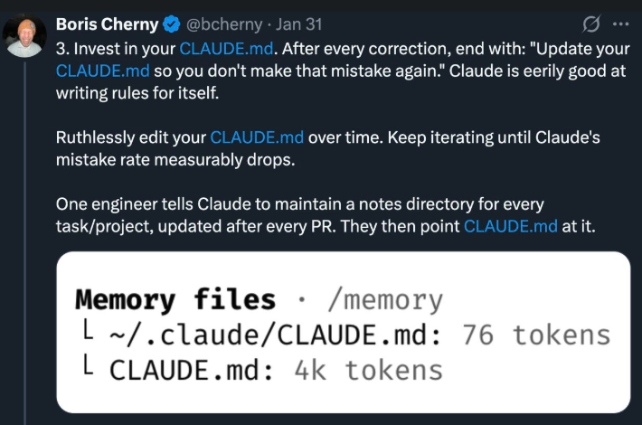

<a id="top"></a>
# Agentic Coding Workflow Guide

A structured approach for working with Claude Code in this repository using specialized agents, commands, and conventions.

---

## Table of Contents

- [Overview: The Workflow](#overview-the-workflow)
- [Phase 1: Iterative Planning](#phase-1-iterative-planning)
- [Phase 2: Implement and Review (Per Phase)](#phase-2-implement-and-review-per-phase)
- [Phase 3: Commit Changes (Manual)](#phase-3-commit-changes-manual)
- [Phase 4: Update Plan with `/update-plan`](#phase-4-update-plan-with-update-plan)
- [Phase 5: Iterate Until Complete](#phase-5-iterate-until-complete)
- [Phase 6: Final Review and PR](#phase-6-final-review-and-pr)
- [Learning from Mistakes with `/learn`](#learning-from-mistakes-with-learn)
- [Quick Reference: Commands](#quick-reference-commands)
- [Agents and Their Roles](#agents-and-their-roles)
- [Validation Commands](#validation-commands)
- [Principles to Remember](#principles-to-remember)
- [Troubleshooting](#troubleshooting)

---

## Overview: The Workflow

This repository is configured with specialized agents and commands that automate the agentic coding workflow. The workflow has two main iterative loops:

```
┌─────────────────────────────────────────────────────────────────────────────┐
│  PHASE 1: ITERATIVE PLANNING                                                │
│                                                                             │
│    /plan ──▶ manual review ──▶ /update-plan ─┐                              │
│       ▲                                      │                              │
│       └──────────── (iterate until ready) ◀──┘                              │
│                            │                                                │
│                            ▼                                                │
│                      Plan Approved                                          │
└─────────────────────────────────────────────────────────────────────────────┘
                             │
                             ▼
┌─────────────────────────────────────────────────────────────────────────────┐
│  PHASES 2-5: ITERATIVE IMPLEMENTATION (per phase)                           │
│                                                                             │
│  ┌────────────────────────────────────────────────────────────────────────┐ │
│  │  PHASE 2: IMPLEMENT + REVIEW LOOP                                      │ │
│  │                                                                        │ │
│  │    /implement Phase N                                                  │ │
│  │         │                                                              │ │
│  │         ▼                                                              │ │
│  │    ┌──────────┐    ┌──────────┐    ┌──────────┐                        │ │
│  │    │Code Write│───▶│Test Write│───▶│  Clean   │                        │ │
│  │    │  Agent   │    │  Agent   │    │  Agent   │                        │ │
│  │    └──────────┘    └──────────┘    └──────────┘                        │ │
│  │         │                                                              │ │
│  │         ▼                                                              │ │
│  │    Validation (validate_code.py)                                       │ │
│  │         │                                                              │ │
│  │         ▼                                                              │ │
│  │    /review ──▶ Fix Issues ──┐                                          │ │
│  │         ▲                   │                                          │ │
│  │         └─── (iterate) ◀────┘                                          │ │
│  │                   │                                                    │ │
│  │                   ▼                                                    │ │
│  │             Review Passed                                              │ │
│  └────────────────────────────────────────────────────────────────────────┘ │
│                      │                                                      │
│                      ▼                                                      │
│  ┌────────────────────────────────────────────────────────────────────────┐ │
│  │  PHASE 3: COMMIT                                                       │ │
│  │                                                                        │ │
│  │    git commit (manual) ──▶ /pr-description (optional)                  │ │
│  └────────────────────────────────────────────────────────────────────────┘ │
│                      │                                                      │
│                      ▼                                                      │
│  ┌────────────────────────────────────────────────────────────────────────┐ │
│  │  PHASE 4: UPDATE PLAN                                                  │ │
│  │                                                                        │ │
│  │    /update-plan ──▶ Adjust remaining phases based on learnings         │ │
│  └────────────────────────────────────────────────────────────────────────┘ │
│                      │                                                      │
│                      ▼                                                      │
│  ┌────────────────────────────────────────────────────────────────────────┐ │
│  │  PHASE 5: NEXT PHASE                                                   │ │
│  │                                                                        │ │
│  │    More phases? ──YES──▶ Return to Phase 2                             │ │
│  │         │                                                              │ │
│  │         NO                                                             │ │
│  │         │                                                              │ │
│  │         ▼                                                              │ │
│  │    All phases complete                                                 │ │
│  └────────────────────────────────────────────────────────────────────────┘ │
└─────────────────────────────────────────────────────────────────────────────┘
                             │
                             ▼
┌─────────────────────────────────────────────────────────────────────────────┐
│  PHASE 6: FINAL REVIEW                                                      │
│                                                                             │
│    /review --commits main..HEAD ──▶ /pr-description ──▶ Open PR             │
└─────────────────────────────────────────────────────────────────────────────┘
                             │
                             ▼
┌─────────────────────────────────────────────────────────────────────────────┐
│  CONTINUOUS: LEARN FROM FEEDBACK                                             │
│                                                                             │
│    /learn <feedback> ──▶ Propose config changes ──▶ Apply (after approval)  │
│                                                                             │
│    Run anytime during or after a session to improve future behavior.         │
└─────────────────────────────────────────────────────────────────────────────┘
```

**Key components:**
- **8 specialized agents** with appropriate models and context bundles
- **10 commands** that orchestrate agent workflows
- **22 skills** that define coding conventions and standards
- **Automatic outputs** saved to `.claude/agent-outputs/`

[Back to top](#top)

---

## Phase 1: Iterative Planning

Create, review, and refine your plan until it's ready for implementation.

### Step 1a: Frame Your Objective

Before running `/plan`, establish a clear picture of what you're building.

**What to include:**

- The specific outcome you want to achieve
- Why this matters (context helps agents make better decisions)
- What success looks like in concrete terms
- Constraints (approved frameworks, existing patterns, performance requirements)

**Example of a weak objective:**
> "Add data validation."

**Example of a strong objective:**
> "Add Pydantic validation to the DataFrame toolkit. Each tool should validate its inputs using Pydantic models, with clear error messages for invalid arguments. Success means: all tool inputs are validated, existing tests pass, new validation tests cover edge cases, and the code follows patterns in `src/my-library/module/tools/`."

**Tips:**

- Reference existing code paths the agent should follow
- Check the `frameworks` skill for approved libraries before requesting new dependencies
- Mention what's explicitly out of scope to prevent over-engineering

### Step 1b: Create a Plan with `/plan`

The `/plan` command dispatches to the **planner agent** which creates a detailed implementation plan.

**Command syntax:**
```
/plan <description>
```

**Example:**
```
/plan Add Pydantic validation models to DataFrame toolkit tools with comprehensive error handling
```

**What the planner agent does:**

1. Loads its context bundle (plan-template + development conventions)
2. Explores the codebase to understand existing patterns
3. Creates a phased plan with clear deliverables
4. Saves output to `.claude/agent-outputs/plans/<timestamp>-<scope>-plan.md`

**Plan structure (from plan-template skill):**

```markdown
# Implementation Plan: [Title]

## Objective
[What we're building and why]

## Success Criteria
- [ ] Criterion 1
- [ ] Criterion 2

## Phases

### Phase 1: [Name]
**Goal:** [Single-sentence summary]

#### Implementation Steps
1. Step with specific file paths
2. Step with expected patterns

#### Test Steps
1. Test case description
2. Edge case coverage

#### Validation
- [ ] `uv run python .claude/scripts/validate_code.py`

#### Done When
- Specific completion criteria
```

### Step 1c: Review and Refine the Plan

**Review the plan** before proceeding:
- Push back if phases are too large (ask to subdivide)
- Validate the plan against your objective
- Check for missing edge cases or requirements

**Iterate using `/update-plan`** to refine:
```
/update-plan @.claude/agent-outputs/plans/<plan-file>.md We need to think more about how we are going to do validation of ... there are a lot of edge cases here, let's enumerate them.
```

Repeat until the plan is solid and ready for implementation.

[Back to top](#top)

---

## Phase 2: Implement and Review (Per Phase)

For each phase in your plan, implement the code, review it, and iterate until the review passes.

### Step 2a: Implement with `/implement`

The `/implement` command orchestrates multiple agents to build a single phase.

**Command syntax:**
```
/implement Phase N from <plan-path>
```

**Example:**
```
/implement Phase 1 from .claude/agent-outputs/plans/2026-02-04T120000Z-pydantic-validation-plan.md
```

**What happens:**

1. **Parse phase requirements** from the plan
2. **Code-writer agent**:
   - Loads bundle (frameworks + coding conventions)
   - Implements source code following existing patterns
   - Runs validation: `ruff format`, `ruff check`, `ty check`
3. **Test-writer agent**:
   - Loads bundle (testing conventions)
   - Writes pytest tests for the new code
   - Covers success paths, edge cases, error handling
4. **Code-cleaner agent**:
   - Cleans and organizes new/modified files
   - Removes bloat, simplifies structure
5. **Final validation**: All lint/type/test commands pass

**Validation commands run automatically via the validate script:**
```bash
uv run python .claude/scripts/validate_code.py
```

### Step 2b: Review with `/review`

After implementation, review the changes and iterate until issues are resolved.

**Command syntax:**
```
/review [target] [--plan <path>] [--src-only | --tests-only]
```

**Target options:**
- `--staged` — Review staged changes (most common)
- `--commits main..HEAD` — Review all commits on branch
- `path/to/file.py` — Review specific files
- (no target) — Defaults to `--staged`

**Filtering options:**
- `--src-only` — Review only source files (style + substance reviewers)
- `--tests-only` — Review only test files (all three reviewers)
- (no filter) — Reviews all files with appropriate reviewers

**Example:**
```
/review --staged --plan .claude/agent-outputs/plans/2026-02-04T120000Z-pydantic-validation-plan.md
```

**What happens:**

1. **Classify files** as source or test files (auto-detected)

2. **Run tests** (if test files in scope) to verify they pass

3. **Style reviewer** checks all files for:
   - Naming conventions
   - Docstring completeness
   - Type hint coverage
   - Import organization
   - Code organization patterns

4. **Substance reviewer** checks all files for:
   - Correctness and edge cases
   - Error handling completeness
   - Design quality
   - Maintainability
   - Testability

5. **Test reviewer** checks test files for:
   - Substantive assertions (not rubber stamps)
   - True functionality testing (behavior, not implementation)
   - Edge case coverage
   - Test data variety
   - Fixture and mock discipline

6. **Aggregate findings** into severity categories:
   - **Critical** — Must fix before merging
   - **Improvement** — Should fix, meaningful quality impact
   - **Nitpick** — Nice to have, stylistic preference
   - **Overlapping concerns** — Issues found by multiple reviewers (high priority)

7. **Save output** to `.claude/agent-outputs/reviews/<timestamp>-<scope>-review.md`

8. **Verdict**: APPROVE, NEEDS CHANGES, or REJECT

### Step 2c: Fix and Iterate

If the review finds issues:
1. Address critical issues (must fix before proceeding)
2. Consider improvement suggestions
3. Nitpicks are optional but indicate polish opportunities
4. Run `/review` again until it passes

**Only proceed to commit when the review passes.**

[Back to top](#top)

---

## Phase 3: Commit Changes (Manual)

Claude Code never commits unless explicitly instructed. After the review passes:

```bash
git add -p                    # Stage changes selectively
git commit -m "feat(scope): implement [phase description]

- Key change 1
- Key change 2

Plan: .claude/agent-outputs/plans/<plan-file>.md"
```

**Tips:**

- Use conventional commit format (feat, fix, refactor, test, docs)
- Reference the plan file for traceability
- Commit working code before moving on—never leave the repo broken
- Optionally generate a phase PR description with `/pr-description`

[Back to top](#top)

---

## Phase 4: Update Plan with `/update-plan`

After completing and committing a phase, sync the plan with current state.

**Command syntax:**
```
/update-plan <plan-path>
```

**Example:**
```
/update-plan .claude/agent-outputs/plans/2026-02-04T120000Z-pydantic-validation-plan.md
```

**What happens:**

1. Fetches and merges latest main (resolves conflicts if any)
2. Analyzes what changed in main that affects the plan
3. Reviews completed phases against actual implementation
4. Creates a new versioned plan file (e.g., `plan-version-2.md`) with updates applied
5. Marks completed phases as done in the new file

> **Note:** The original plan file is never modified. All updates are written to a new versioned copy.

**Why this matters:**

- Code and scope may have changed during implementation requiring adjustment for next phases (e.g. changed originally planned interfaces...)
- You may have discovered edge cases or new requirements
- Main branch may have evolved while you worked
- Fresh planning prevents drift from the original vision

[Back to top](#top)

---

## Phase 5: Iterate Until Complete

Repeat Phases 2-4 for each remaining phase in the plan:

1. `/implement Phase N+1 from <plan-path>` — implement code and tests
2. `/review --staged --plan <plan-path>` — review and fix until passing
3. `git commit -m "..."` — commit the changes
4. `/update-plan <plan-path>` — update and adjust the plan

**Checkpoint questions after each iteration:**

- Does the code still align with the original objective?
- Are we accumulating technical debt that needs addressing?
- Is the remaining plan still realistic?
- Should we adjust scope based on what we've learned?

**Warning signs to pause and reassess:**

- Implementation diverging significantly from plan
- Tests becoming brittle or hard to write
- Growing list of "fix later" items
- Unclear how current work connects to the objective

[Back to top](#top)

---

## Phase 6: Final Review and PR

Once all phases are complete:

**1. Run comprehensive code review:**
```
/review --commits main..HEAD --plan <plan-path>
```

This reviews all changes since branching from main, including style, substance, and test quality.

**2. Address any final issues**

Fix any remaining issues found in the comprehensive review.

**3. Generate PR description:**
```
/pr-description --plan <plan-path> --phases 1,2,3
```

This creates a structured PR description at `.claude/agent-outputs/pr-descriptions/`.

**4. Open the PR**

[Back to top](#top)

---

## Learning from Mistakes with `/learn`



The `/learn` command closes the feedback loop. When Claude does something poorly (or well), tell it — and the configuration updates so it doesn't repeat the mistake (or keeps doing the right thing).

**Command syntax:**
```
/learn <feedback>
/learn <feedback> --no-session
```

**What happens:**

1. The **config-learner agent** analyzes your feedback alongside the current conversation context
2. It reads the existing configuration (skills, agents, commands, CLAUDE.md) to understand the landscape
3. It checks for contradictions with existing rules and surfaces any conflicts
4. It proposes targeted changes — updating an existing skill, adding a Critical Rule, or creating a new skill/agent
5. You review and approve the changes before they're applied
6. After applying, it syncs the manifest, regenerates bundles, and validates

**When to use it:**

- **After a mistake**: Claude forgot to run tests, used the wrong pattern, or over-engineered something
- **After a good session**: Claude did something well that you want to reinforce as a permanent convention
- **For new patterns**: You want Claude to learn a team convention or workflow it doesn't know yet
- **Anytime**: Unlike other commands, `/learn` isn't tied to a specific workflow phase — use it whenever you have feedback

**Examples:**
```
/learn You kept using Optional[str] instead of str | None. Enforce the modern union syntax.
/learn You over-engineered the parser. On first pass, produce focused minimal implementations.
/learn Always run tests before claiming a task is done. --no-session
/learn Learn how to write database migration scripts following our team's conventions.
```

The `--no-session` flag excludes conversation context, useful for narrow, general-purpose learnings that don't need session history.

[Back to top](#top)

---

## Quick Reference: Commands

| Command | Purpose | Output Location |
|---------|---------|-----------------|
| `/plan <desc>` | Create implementation plan | `agent-outputs/plans/` |
| `/implement Phase N from <path>` | Execute a plan phase | Modified source files |
| `/review [target]` | Full review (style + substance + test quality) | `agent-outputs/reviews/` |
| `/review --src-only` | Source code review only | `agent-outputs/reviews/` |
| `/review --tests-only` | Test quality review only | `agent-outputs/reviews/` |
| `/update-plan <path>` | Sync plan with reality | New versioned plan file |
| `/pr-description` | Generate PR description | `agent-outputs/pr-descriptions/` |
| `/learn <feedback>` | Improve config from feedback | Updated skills, agents, CLAUDE.md |
| `/create-skill` | Scaffold new skill | `skills/<name>/` |
| `/sync` | Regenerate CLAUDE.md and bundles | Various config files |

[Back to top](#top)

---

## Agents and Their Roles

| Agent | When Used | What It Knows |
|-------|-----------|---------------|
| **planner** | `/plan` | Plan template, all development conventions |
| **python-code-writer** | `/implement` | Frameworks, all code conventions |
| **python-test-writer** | `/implement` | Testing conventions, pytest patterns |
| **code-style-reviewer** | `/review` | Style conventions, naming, organization |
| **code-substance-reviewer** | `/review` | Design, correctness, maintainability |
| **test-reviewer** | `/review` | Test quality, coverage completeness, assertions |
| **code-cleaner** | `/implement`, `/clean` | Code organization, simplification |
| **config-learner** | `/learn` | Skill templates, manifest validation |

Each agent loads a **context bundle**—pre-composed skill content that gives it exactly the knowledge it needs.

[Back to top](#top)

---

## Validation Commands

These run automatically during `/implement` and should pass before committing:

```bash
# Run all checks (lint, format, type, docstring, tests)
uv run python .claude/scripts/validate_code.py

# Run specific checks
uv run python .claude/scripts/validate_code.py --lint --type

# Run on specific path
uv run python .claude/scripts/validate_code.py --lint src/
```

See the `validate-code` skill for full usage and flags.

[Back to top](#top)

---

## Principles to Remember

1. **Commands orchestrate, agents execute:** Use the commands—they handle agent coordination and context loading.

2. **Plans are living documents:** Update them as reality unfolds with `/update-plan`.

3. **Two-stage review catches more:** Style review (fast, conventions) + substance review (thorough, design).

4. **Verify test quality explicitly:** AI tends to optimize for appearance over substance. Passing tests don't guarantee meaningful tests. The `/review` command includes test quality checks automatically; use `--tests-only` to focus exclusively on test quality.

5. **You own the code:** Review everything. Agents are capable but not infallible. AI can do better when pushed—its default is often minimal effort.

6. **Commit manually:** Claude Code never commits unless you explicitly ask—this keeps you in control.

7. **Trust the conventions:** Skills encode project standards. Agents load them automatically via bundles.

8. **Outputs are saved:** Plans, reviews, and PR descriptions persist in `agent-outputs/` for reference.

9. **Teach, don't repeat:** When Claude makes the same mistake twice, use `/learn` to update the configuration rather than correcting it again manually. Every `/learn` invocation makes all future sessions better.

[Back to top](#top)

---

## Troubleshooting

**Agent seems to lack context about conventions:**
- Run `/sync` to regenerate bundles
- Check that `manifest.json` lists correct skill dependencies

**Plan doesn't match what I want:**
- Review the plan before `/implement`
- Ask for revisions or create a new plan with clearer objective

**Implementation diverges from plan:**
- Stop and run `/update-plan` to realign
- Break large phases into smaller ones

**Review finds many issues:**
- `/implement` should auto-fix critical issues
- For persistent problems, the plan may need revision

**Claude keeps repeating the same mistake:**
- Use `/learn` with specific feedback about what went wrong
- The config-learner agent will propose skill or CLAUDE.md changes to prevent recurrence
- For session-specific issues, run `/learn` within the same session so it has full context

**Need a new skill or convention:**
- Use `/create-skill` to scaffold
- Add to `manifest.json` dependencies
- Run `/sync` to regenerate bundles

**Tests look suspicious or too simple:**
- Run `/review --tests-only` to audit test quality
- Look for rubber-stamp assertions (`assert result is not None`)
- Check for repetitive test data (same values in every test)
- Verify edge cases are actually tested

**Test quality degrades later in implementation:**
- This is common as context fills—AI starts taking shortcuts
- Run `/review --tests-only` on all new test files before committing
- Consider breaking large phases into smaller chunks
- Ask explicitly for varied test data and edge case coverage

[Back to top](#top)
