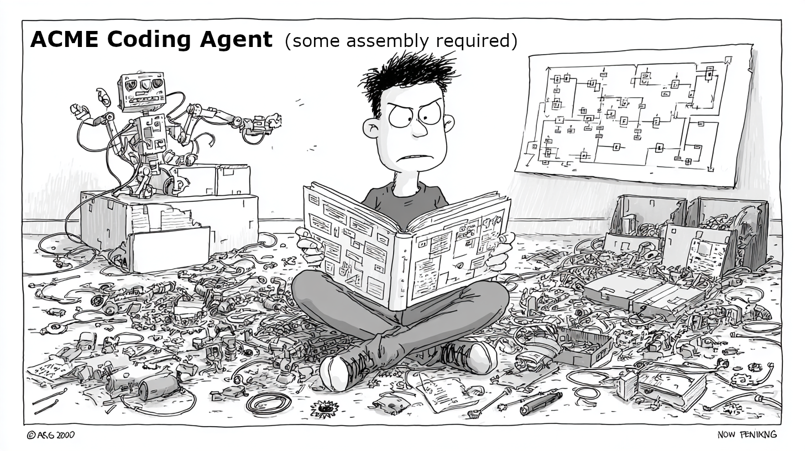

# Understanding Your AI Coding Agent: Some Assembly Require

AI coding agents feel like magic. You describe a feature, and the agent writes code, runs tests, reads the errors, fixes the bugs, and iterates until everything passes (usually). It looks like thinking. It looks like understanding. And sometimes it feels like gambling.

That gambling feeling comes from not understanding the machine. Once you grok the mechanisms driving AI coding agents, you'll use these tools far more effectively.

---

## The engine: pattern matching at scale

The centerpiece of every coding agent is a large language model (LLM) that has been trained on billions of lines of code. It has seen countless examples of every design pattern, every framework idiom, and every common algorithm. When you give the LLM a prompt, it activates the neural pathways most associated with that input and produces a statistically likely output. This makes LLMs remarkably good at generating code that's indistinguishable from human-written code, because they've absorbed these patterns across an enormous corpus.

But there are important caveats:

- **The knowledge is stale.** Training has a cutoff date. The model doesn't know about the library you released last month or the API that changed last week.
- **Modern usage is underrepresented.** Training data skews toward whatever was publicly available at scale, so newer patterns and frameworks are less well-represented than established ones.
- **The model was trained on the kitchen sink.** The model was trained on *all* code, not just the best code. Stack Overflow answers, tutorial snippets, abandoned repos, copy-pasted boilerplate — it's all in there. Post-training techniques are used to reinforce good answers and guide the model toward higher-quality outputs, but without specific prompting it's still drawing on a very broad distribution.

---

## Steering the output by controlling the input

Two properties of how LLMs work make your input the most important lever you have.

**First: every output token looks at your input.** When the model generates code, each token it produces attends directly to the tokens you sent in. If your input contains three well-written functions that follow your team's naming conventions, the model can — and will — copy those patterns into its output. This is called *in-context learning*. The model doesn't need to have seen your conventions during training. It just needs to see them in the input right now. A few concrete examples in the prompt act as a template that the model will mimic, often more reliably than any written instruction.

**Second: your input activates stored knowledge.** During training, the model encoded an enormous amount of knowledge — design patterns, framework idioms, algorithms, debugging strategies — distributed across different parts of its network. All of that knowledge is sitting there, but only a fraction of it is relevant to any given task. Your prompt is the map. It determines which pockets of stored knowledge light up and which stay dormant. The model has the ability to combine what it knows in virtually limitless ways, but it needs your input to guide it down the right path and unlock the right pieces for *this* specific task.

These two mechanisms work together. Your input simultaneously gives the model patterns to mimic *and* tells it which region of its vast training to draw from. This is the entire mechanism behind "skills," "custom instructions," and "system prompts" — they're text prepended to the input that both demonstrates the patterns you want and activates the relevant knowledge the model already has.

Here's a useful mental model: **think of the LLM as the world's biggest choose your own adventure book.** Every prompt is a fork in the path. A vague prompt — "write clean code" — leaves millions of paths open. The model picks one based on probability, and you're essentially playing the lottery. But a specific prompt collapses those branching paths into a narrow corridor.

Consider the difference between these two role prompts:

> *"You are an expert Python test writer specializing in the pytest framework."*

> *"You are a battle-hardened Rust developer, an expert at writing performance-critical code."*

Same model, radically different adventures. The first activates knowledge about test fixtures, parametrization, assertion patterns, and mocking. The second activates knowledge about ownership, zero-cost abstractions, unsafe blocks, and benchmarking.

The practical takeaway: **the more specific your input, the narrower the adventure.** Vague prompts wander through the model's vast, generic knowledge and produce average code. Detailed prompts with examples and constraints guide the model down a specific path, activating precise knowledge and giving it concrete patterns to follow, resulting in code that looks like your best engineer wrote it.

---

## Persistent context: standardizing the adventure

If every prompt determines which adventure the model takes, then coding agents have a bootstrapping problem: every new conversation starts from zero. The model doesn't remember that your team uses Google-style docstrings, prefers composition over inheritance, or names test files a certain way. Without persistent context, you'd need to re-specify all of this every single turn.

This is the purpose of agent configuration files — system prompts, custom instructions, CLAUDE.md files, cursor rules, whatever your tool calls them. They're text that gets prepended to every conversation, ensuring the model starts every session on the same page, aimed at the same adventure.

In theory, this is enormously powerful. In practice, most agent configuration files are terrible.

The typical agent file is full of directives like "write clean, maintainable code" and "follow best practices." This is the prompt equivalent of telling someone to "be good at your job." It's vague, it's generic, and it wastes precious context window space activating nothing in particular. The model already tries to write decent code by default — you don't need to burn tokens telling it to.

What actually works is *concrete specificity*:

- **Bad:** "Follow good naming conventions"
- **Good:** "Use snake_case for functions and variables. Prefix private methods with underscore. Name test files `test_{module}.py` and test functions `test_{function}_{scenario}`."

- **Bad:** "Write well-structured code"
- **Good:** "Functions should do one thing. If a function exceeds 20 lines, extract helpers. Use Pydantic models for data validation at boundaries, dataclasses for internal data transfer."

- **Bad:** "Include appropriate error handling"
- **Good:** "Raise `ValueError` for invalid arguments. Use custom exception classes defined in `exceptions.py`. Never catch bare `Exception` — catch specific types."

Every vague directive is a missed opportunity. You have a finite context window, and every token counts. Fill it with the specific patterns, examples, and constraints that actually narrow the model's path to the specific adventure your team wants to be on, every single session.

---

## The illusion of memory

The LLM itself has no memory. Each time it generates a response, it starts completely fresh. It doesn't remember what you asked five minutes ago. It doesn't know it just wrote a function for you.

The **agent wrapper** solves this by replaying the entire conversation history as input every single turn:

- **Turn 1:** system prompt + your message → response
- **Turn 2:** system prompt + full conversation so far → response
- **Turn 3:** system prompt + *entire* conversation so far → response

From the model's perspective, every turn is the first turn. It just happens to receive a very detailed input that includes everything that "happened" before. The continuity you experience — the sense that the agent "remembers" your project, your preferences, the bug you're chasing — is constructed entirely by the wrapper feeding the full history back in.

This also explains why long conversations degrade. The context window has a finite size. As the conversation grows, older content gets truncated or compressed, and the model loses access to earlier context. It's not "forgetting" — it literally can't see it anymore.

**Practical implication:** Start fresh conversations for new tasks. Don't expect a session from the feature you just implemented to carry useful context into an unrelated bug hunting session.

---

## Tool calling: from suggestions to actions

It's important to recognize that, on its own, the model can only generate text. Without tools, the workflow looks like this: you ask the model for help, it suggests a shell command or writes a function, and then *you* copy that output, switch to your terminal or editor, paste it in, run it, read the result, copy the result back, and feed it to the model for the next step. You're the gofer. The model does the thinking, but you do all the doing — copying, pasting, navigating between windows, running commands, shuttling context back and forth. It works, but it's slow, error-prone, and exhausting for anything beyond a quick question.

Tool calling changes this completely. Instead of suggesting actions in prose, the model can generate structured commands that the agent wrapper executes directly in your environment. Read a file. Write code to the correct path. Run a shell command. Search the web for documentation. The model emits the action and the wrapper carries it out.

The mechanics are the same as everything else we've discussed — the model generates tokens based on probability given the input. But the system prompt includes tool descriptions (name, purpose, parameter schema), and the model has been trained to emit structured tool calls when they're appropriate. So instead of outputting "you should run `pytest`," it outputs a tool call that *actually runs pytest*. Instead of printing a function and telling you where to put it, it writes the function directly to the correct file.

This is the difference between an LLM that advises and an agent that acts. The model doesn't need you to be its hands anymore — it can read your codebase, make changes, and execute commands without you touching the keyboard.

---

## The feedback loop: where the real power lives

But acting alone isn't enough. If the model writes code and never sees whether it worked, it's just generating text into the void — faster than copy-paste, but not fundamentally smarter. The real power of a coding agent comes from **closing the loop**: the wrapper feeds the results of each tool call back into the conversation as new input, so the model can react to what actually happened:

1. The model sees your task and generates code
2. The wrapper writes the code to a file and runs the tests
3. The test output (including any failures) goes back into the context
4. The model sees the failure, recognizes the pattern, and generates a fix
5. The wrapper applies the fix and runs the tests again
6. The loop continues until the tests pass

Now the model can see whether its code actually works. Each iteration, it's pattern-matching against a richer, more specific input that includes *actual outcomes* from the real environment.

The model doesn't need to reason from first principles about whether its code is correct. It can *see* the test output and match against patterns it's seen a million times: "this traceback means this kind of bug, which is typically fixed by this kind of change."

It's still using the same fundamental mechanism: pattern matching on input, but now the input includes live feedback from your coding environment.

---

## The complete picture

An LLM coding agent is not magic. It's a handful of straightforward pieces wired together in a logical loop:

| Layer | What it does |
|---|---|
| **LLM** | Generates probable output from input, drawing on billions of lines of training code and post-training preference tuning |
| **Context control** | Shapes the input with your conventions, examples, and instructions |
| **Persistent context** | Agent files that standardize the adventure across sessions with concrete patterns and examples |
| **Conversation history** | Replays the full conversation each turn, creating the illusion of memory |
| **Tool calling** | Lets the model emit structured actions instead of just text |
| **Feedback loop** | Feeds real-world results back as input so the model can self-correct |

Every "smart" behavior you see — writing code, running tests, reading errors, fixing bugs, iterating until things work — emerges from this loop. The model itself does the same thing every time: reads its input and generates output based on probability and training.

---

## What this means for how you use these tools

Understanding the mechanism changes how you work with it:

1. **Invest in context.** The single highest-leverage thing you can do is give the model better input: coding standards, examples, clear constraints. This isn't optional polish — it's the primary control surface.

2. **Keep sessions focused.** Long, sprawling conversations degrade because the context window fills up. Start fresh when you change topics.

3. **Trust the loop, not the first attempt.** The first output is a starting point. The real value comes from the feedback cycle — let the agent run tests, see failures, and iterate.

4. **Don't over-anthropomorphize.** Whatever's happening inside the model, the most useful framing when things go wrong is "it's matching against the wrong patterns." When it gets stuck in a loop or produces nonsense, it's your job to clear the context and change the input.

The choose your own adventure book is always there, with all of its paths. Your job is to make sure the model is reading the right chapter.
